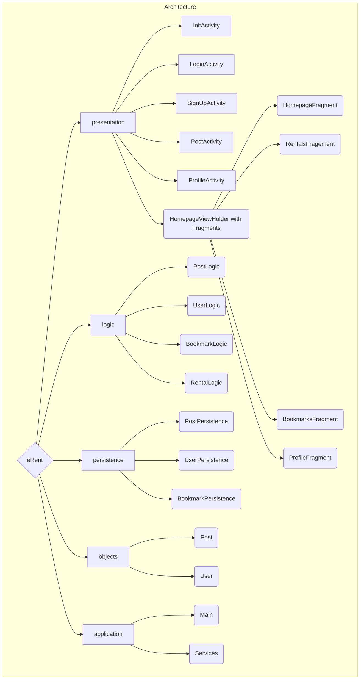

# Architecture

## Diagram
Here is a visual representation of our current architecture

## Packages
- presentation: holds the UI code
- logic: holds the logic/business code
- persistence: holds the code relating to the database
- application: provides a single source of data the UI layer can use to access the logic layer through dependency injection