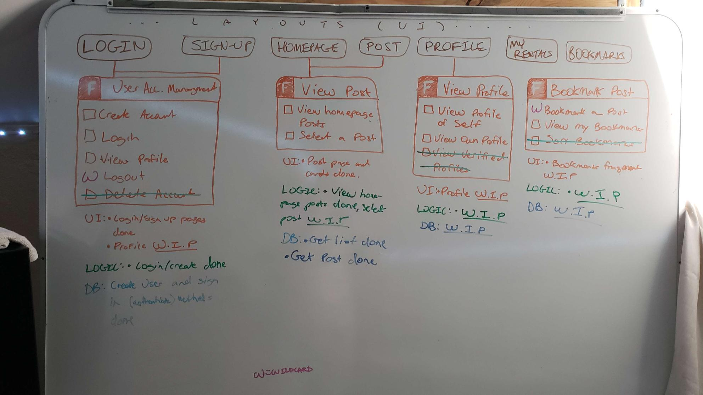
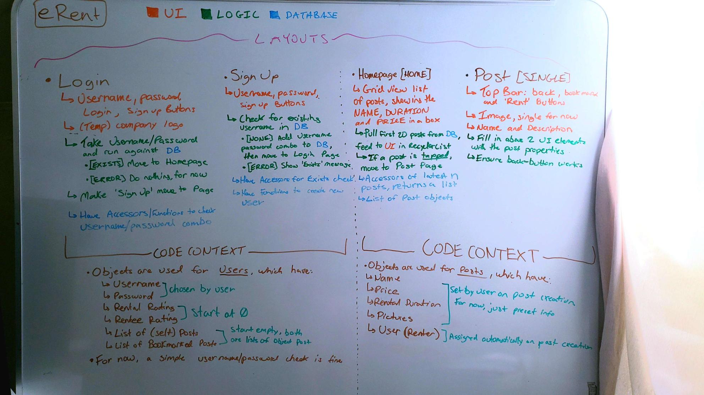

# Iteration 2 Worksheet

### Paying off Technical Debt

1. The homepage of our app has a list of several buttons to show rental posts that have been made. At the end of iteration 1, these buttons used data from post objects for some displays, but not everything (the name was correct, but other elements like duration and price were defaults). This was done in [this](https://code.cs.umanitoba.ca/3350-summer2023/segmentationfault/-/blob/7f36f69e37d713f3b4cb56b068a7fc26cfdb2ff9/app/src/main/java/com/erent/presentation/PostActivity.java#L44) commit. This was Deliberate and Prudent technical debt because we knew this was important and would need to be done, but we didn't have time in iteration 1 to do it.
2. The login/signup part of our app had been started, but not completed or linked together with the rest of the app by the end of iteration 1. Login was done in [this](https://code.cs.umanitoba.ca/3350-summer2023/segmentationfault/-/blob/6b67e0dc07b3948577888dda77608cc011fd95cd/app/src/main/java/com/erent/presentation/LoginActivity.java#L47) commit and signup was done in [this](https://code.cs.umanitoba.ca/3350-summer2023/segmentationfault/-/blob/70869fb4853194bad3cb2ed7284082601a0a55c6/app/src/main/java/com/erent/presentation/SignUpActivity.java#L31) commit. This was Deliberate and Prudent technical debt because we knew this was important and would need to be done, but we didn't have time in iteration 1 to do it.

### SOLID

We created this [issue](https://code.cs.umanitoba.ca/3350-summer2023/teameleven-11/-/issues/82) which addresses a Single Responsibilty Principle violation.

### Retrospective

A big takeaway we had from the retrospective was the importance of planning early and having good dev tasks. This iteration, we made sure to do a better job with planning and dev tasks to help keep us on task and help us get more done.

Evidence:
- We planned over Discord and using whiteboards (to map our layers, layouts and overall hierarchies). 

- Dev Tasks for Iteration 1 are listed [here](https://code.cs.umanitoba.ca/3350-summer2023/segmentationfault/-/issues/?sort=created_date&state=all&label_name%5B%5D=Dev%20Task&milestone_title=Iteration%201&first_page_size=20).
- Dev Tasks for Iteration 2 are listed [here](https://code.cs.umanitoba.ca/3350-summer2023/segmentationfault/-/issues/?sort=created_date&state=all&milestone_title=Iteration%202&label_name%5B%5D=Dev%20Task&first_page_size=20).

### Design Patterns

We use the singleton design pattern (or at least a form of it) to get the references to our persistence objects. The `Services` class defines a static variable and accessor method for each persistence object and ensures that only 1 instance of these persistence objects will exist at a given time.

The `Services` class can be found [here](https://code.cs.umanitoba.ca/3350-summer2023/segmentationfault/-/blob/0e3a1d64703e6227128539e0378a832751183ab2/app/src/main/java/com/erent/application/Services.java).

The singleton design pattern is described [here](https://refactoring.guru/design-patterns/singleton).

### Iteration 1 Feedback Fixes

Link: [Post List View](https://code.cs.umanitoba.ca/3350-summer2023/segmentationfault/-/issues/48).

There were 2 problems described in this issue:

1. There were buttons that were clickable, but nothing would happen when the user clicked on them. It was flagged because the work was incomplete, and incomplete work is effectively no work, but we still had it in the project.

    - Fixed when we added the page and logic to go to, when the button was pressed. This was done [here](https://code.cs.umanitoba.ca/3350-summer2023/segmentationfault/-/blob/0863a3e72a85e00b3b4482863b67b86e3f8bbbeb/app/src/main/java/com/erent/presentation/HomepageFragment.java#L45).

2. The buttons had a fixed size, which caused them to clip into each other sometimes. It was flagged because this is behaviour should not happen and is therefore a bug.

    - Fixed by changing button size from a fixed value to a range. This was done in [this](https://code.cs.umanitoba.ca/3350-summer2023/segmentationfault/-/commit/acb1c9ff1758e2c621d3f4bb1e0809f8ba64e6ca) commit.