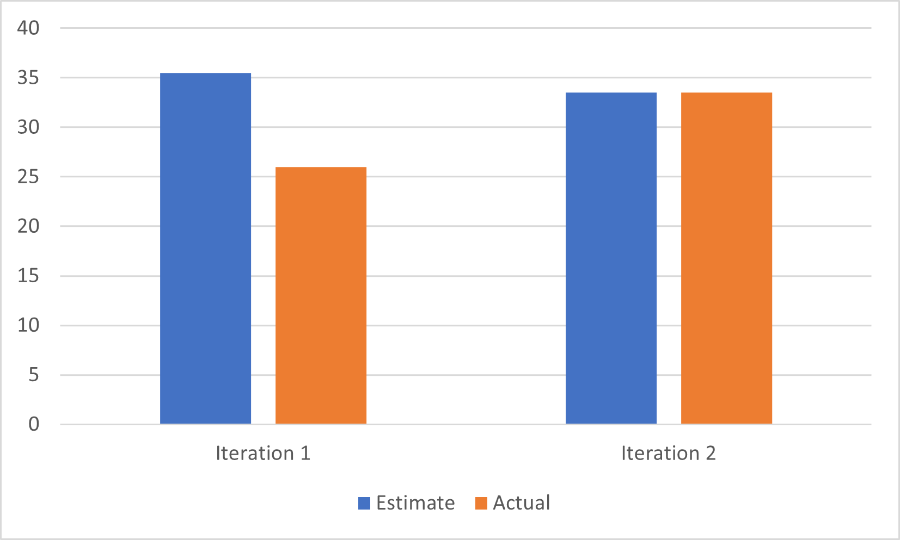

# Iteration 2 Retrospective

During our meeting, we looked back on iteration 2 to see what had gone well and what had gone poorly. We had improved a lot over iteration 1: we had better communication, a clearer sense of who was doing what, and we got more done. We made sure to celebrate what had gone well, but we also made sure to look at what had gone poorly so we could improve for iteration 3.

The primary part of the project that has not been as successful as we would have liked this iteration has been branching. We had decided at the beginning of the project on using a modified version of GitFlow for branching strategy: we had a main branch, a dev branch, and a working branch for each task which would get merged into dev before dev got merged into main. This worked well during iteration 1 and helped us keep our code and work clean. Shortly after iteration 2 started, some mistakes were made that led to an effective abandonment of this branching strategy. We had work branches off of other people's work branches, commits appearing in multiple different merge requests, and a fair share of merge conflicts. While we managed to remain productive and were able to get our work done, we all agreed that this needed to change for iteration 3.

To address this problem during iteration 3, we have reminded ourselves of what the branching strategy should look like and decided that, without justifiable reason, branches for work on tasks should only ever originate from dev and not from other working branches. This should keep commit history much cleaner and reduce merge conflicts. Less complex commit historys and change logs should also make code review a smoother and easier process, which should make it happen faster, which should mean merge requests get merged into dev more quickly. This will be important as the main reason we started branching off of working branches in iteration 2 was because a piece of work was blocked behind other work that was sitting in an un-reviewed or merge request or one that needed some more work done. By getting merge requests reviewed and merged faster, there will be less reason to branch off of a working branch, and this should create a positive feedback loop that helps us maintain a good branching strategy.

Another part of the project worth discussing is our velocity. While we had overestimated during iteration 1, primarily because we didn't expect learning Android Studio to take as much time as it did, we had been much better at estimating during iteration 2 and had gotten much more done. We attributed these to the group having more experience, with Android Studio and in general, and the group doing a better job at planning and creating dev tasks to help us stay on track. As such, we decided to keep our eyes on these areas and continue the success into iteration 3 through planning ahead and assigning ourselves a reasonable amount of work.