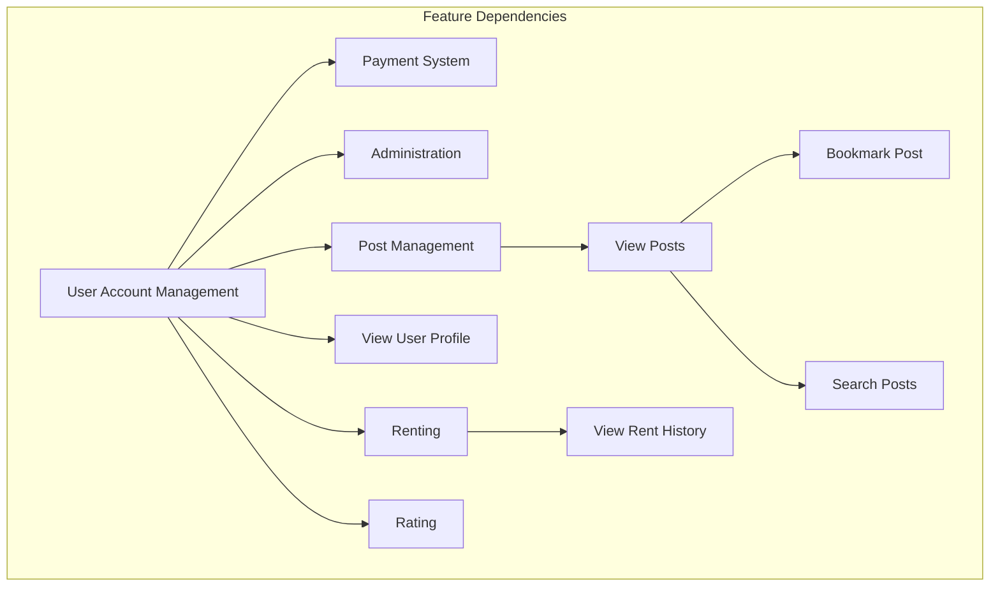

# SegmentationFault

An app which is based off the old saying *"Try-before-you-buy"*, where reducing waste is priority number 1.

## Vision Statement
SegmentationFault's App will be a storefront to rent out items and equipment which would normally sit unused. Users can be both a **Renter** and a **Rentee** and anyone can sign-up, including businesses. **Renters** can post their items and specify price, availability and max rental duration. **Rentees** can browse the homepage, search and then items, and rate previous rent experiences. A rating-based honour system helps users understand risk between both exchanging sides, as it's split into **Renter** and **Rentee** scores. In addition, the process of posting, renting and paying is streamlined in a "marketplace" fashion to make the entire experience as easy as possible. Every feature is created with our motto in mind: *"Try-before-you-buy"*, with the goal of reducing over-consumption and waste.

 

### Value Proposition
Our storefront App encourages waste-reduction and community growth through mutually beneficial renting of items. Users who own things they don't normally use, such a Boat, can rent it for passive income, to another user anytime they wish, as an extra source of income. On the flipside, a user who may be looking to buy a boat, but doesn't know if they want to commit to such a purchase, can rent from the aforementioned user and try it out. Both users win; the **Renter** makes passive income; the **Rentee** gets to use the boat, and can decide whether they want to buy or just continue renting. This *"Try-before-you-buy"* model is at the heart of our App, with the goal of reducing over-consumption and waste. These exchanges are also backed by our dual-rating system, where users have a renter and rentee score respectively, so no side is left skeptical.

 

### Success Criteria
Our success for the App is represented by our 3 core features: renting an item, posting rentals, and ratings.
- **Renting an item**: All users are able to find an item they wish to rent, through our homepage or by searching, and obtain a rental agreement through our supported payment methods. This agreement includes rental duration, cost and delivery/pick-up method.
- **Posting rentals**: All users are able to post their item for rent by uploading images, setting availability, accepted payment methods and pick-up/delivery options. Any request by a user wishing to rent out something can also be denied, if the user who posted thinks their rating is too low.
- **Ratings**: All users are able to receive ratings for items they rented or items they themselves rented out, and can see other users ratings as well. This self-sustaining honour system is clearly represented on all profiles and postings.

## Feature Hierarchy

